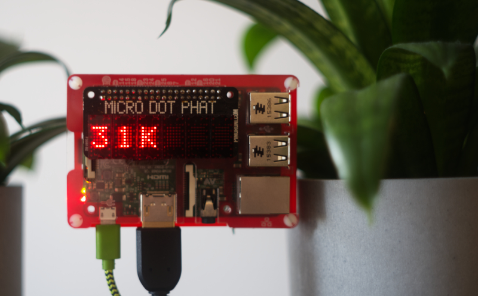

# microdot-phat-youtube-subscribers

Python script to display your YouTube Subscriber count on the Pimoroni Micro Dot pHAT.



## Dependencies

**[Micro Dot pHAT library][1]:**

```bash
sudo apt-get install python3-microdotphat
```

or

```bash
curl https://get.pimoroni.com/microdotphat | bash
```

**[Python YouTube][2]:**

```bash
sudo pip3 install --upgrade python-youtube
```

## Installing

Clone the project:

```bash
git clone https://github.com/BramDriesen/microdot-phat-youtube-subscribers.git
```

Copy the default-config file to config.py

```bash
cp default-config.py config.py
```

Edit the configuration file and add the YouTube channel you want to monitor, and the YouTube Statistics V3 API key.

```python
API_KEY = "YOUR API KEY"
CHANNEL_ID = "YOUR CHANNEL ID"
 ```

NOTE: Make sure to enable the setting "Wait for network on boot" in the Raspberry Pi config screen. Use `sudo raspi-config` to go to the settings.


## Usage

To simply run the script execute the script file.

```bash
python3 script.py
```

## Autostart

Edit your `rc.local` (or use any other method as [described here][3]) file to make the script run at boot. Edit it using the command:

```bash
sudo nano /etc/rc.local
```

Using your cursor keys scroll to the bottom and add the following line right before the `exit 0` line:

```bash
sudo python3 /home/pi/microdot-phat-youtube-subscribers/script.py & > /home/pi/youtube-subscribers.log
```

Now reboot your Pi and the script should automatically start.

```bash
sudo reboot
```

[1]: https://github.com/pimoroni/microdot-phat
[2]: https://github.com/sns-sdks/python-youtube
[3]: https://www.dexterindustries.com/howto/run-a-program-on-your-raspberry-pi-at-startup/
